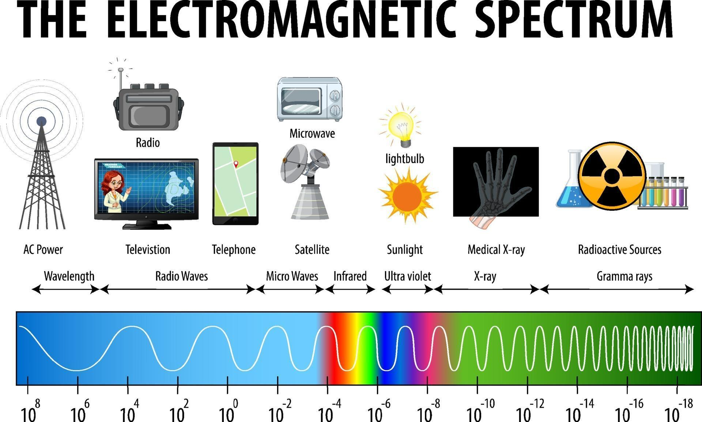

# UAV Multispectral Data for Plant Pathology Studies

## Table of Contents
1. [Introduction](#introduction)
2. [Electromagnetic Signals](#electromagnetic-signals)
3. [Camera and Sensor System](#camera-and-sensor-system)
4. [Spectral Bands and Wavelengths](#spectral-bands-and-wavelengths)
5. [Data Structure](#data-structure)
6. [Data Preprocessing](#data-preprocessing)
7. [Applications of UAV Multispectral Data](#applications-of-uav-multispectral-data)
8. [Challenges and Considerations](#challenges-and-considerations)
9. [References](#references)
   

---

## Introduction
UAV multispectral data has revolutionized remote sensing by providing precise, efficient, and versatile tools for data acquisition. Equipped with advanced multispectral cameras like the **MicaSense RedEdge-P™**, UAVs can collect detailed information essential for industries such as agriculture, forestry, and environmental monitoring. This specific dataset is being used to advance plant disease modeling by leveraging multi-angular UAV data for studying plants under pathogen stress.

---

## Electromagnetic Signals
Electromagnetic (EM) signals are the foundation of remote sensing. They are emitted or reflected by objects on the Earth's surface and provide critical information about the properties of these objects. In the case of multispectral data, different materials interact with electromagnetic radiation in distinct ways, depending on their physical and chemical properties.

The **MicaSense RedEdge-P™** camera captures electromagnetic signals across various wavelengths, which allows the differentiation of plant health, disease symptoms, and other environmental factors. In this context, multispectral data is essential for analyzing spectral signatures that reflect stress caused by pathogens, especially when captured from multiple angles.



---


## Camera and Sensor System

### MicaSense RedEdge-P™
The **MicaSense RedEdge-P™** is a high-performance multispectral camera designed for UAV-based remote sensing. Key features include:
- **Five Narrow Spectral Bands**: Captures data with precision across specific wavelengths (detailed in the next section).
- **High Resolution**: Provides professional-grade imagery for detailed analysis.
- **Global Shutter**: Ensures distortion-free images, even during rapid UAV movement.
- **Fast Capture Rate**: Capable of acquiring images at high speeds for efficient data collection.

For more details on the **MicaSense RedEdge-P™**, visit the [camera documentation](https://github.com/tamer017/Multi-Angular-Photogrammetry/edit/master/docs/camera.md).

### DLS 2 (Downwelling Light Sensor)
The **DLS 2** system measures ambient light conditions during data capture. It:
- Adjusts for changes in sunlight to improve reflectance calibration.
- Includes an integrated GPS for geotagging images.

---

### Example Images

 
 
 
 
 


---

## Spectral Bands and Wavelengths

The **RedEdge-P™** camera captures data across five spectral bands, as detailed below:

| **Spectral Band** | **Wavelength Range (nm)** | **Applications**                                   |
|--------------------|---------------------------|---------------------------------------------------|
| Blue               | 475 ± 20                 | Water body monitoring, vegetation discrimination  |
| Green              | 560 ± 20                 | Vegetation health, plant vigor                    |
| Red                | 668 ± 10                 | Chlorophyll absorption, soil boundaries          |
| Red Edge           | 717 ± 10                 | Early stress detection in plants                 |
| Near-Infrared (NIR)| 842 ± 26                 | Vegetation health (NDVI), biomass estimation     |

### MultiSpectral Bands images  


---


## Data Structure

 Each flight contains six images per channel (one per spectral band, named `IMG_number_1.tif` to `IMG_number_6.tif`).


```
data/
│
├── flight_1/
│    └── raw_data/
│       ├── IMG_0200_1.tif  # Blue channel (475 ± 20 nm)
│       ├── IMG_0200_2.tif  # Green channel (560 ± 20 nm)
│       ├── IMG_0200_3.tif  # Red channel (668 ± 10 nm)
│       ├── IMG_0200_4.tif  # Red Edge channel (717 ± 10 nm)
│       ├── IMG_0200_5.tif  # Near-Infrared channel (842 ± 26 nm)
│       └── IMG_0200_6.tif  # Optional extra image (e.g., reflectance panel or calibration image)
│
└── flight_2/
     └──raw_data/
        ├── IMG_0300_1.tif  # Blue channel (475 ± 20 nm)
        ├── IMG_0300_2.tif  # Green channel (560 ± 20 nm)
        ├── IMG_0300_3.tif  # Red channel (668 ± 10 nm)
        ├── IMG_0300_4.tif  # Red Edge channel (717 ± 10 nm)
        ├── IMG_0300_5.tif  # Near-Infrared channel (842 ± 26 nm)
        └── IMG_0300_6.tif  # Optional extra image (e.g., reflectance panel or calibration image)
```

Each image is named based on the corresponding spectral band:
- **IMG_number_1.tif**: Blue channel (475 ± 20 nm)
- **IMG_number_2.tif**: Green channel (560 ± 20 nm)
- **IMG_number_3.tif**: Red channel (668 ± 10 nm)
- **IMG_number_4.tif**: Red Edge channel (717 ± 10 nm)
- **IMG_number_5.tif**: Near-Infrared channel (842 ± 26 nm)
- **IMG_number_6.tif**: Optional extra image (e.g., a calibration panel image)

### Explanation:
- **IMG_number_1.tif to IMG_number_6.tif**: These are the image files for each spectral band, where `IMG_number` represents a unique identifier for each flight. For example, `IMG_0200_1.tif` represents the Blue channel image from the first flight (ID 0200).


### Metadata Fields
Each flight should include metadata:
- **Camera Model**: MicaSense RedEdge-P™  
- **Light Sensor**: DLS 2  
- **Date and Time**: For temporal analysis.  
- **Flight Altitude**: Ensures reproducibility.  
- **GPS Coordinates**: Geolocation of each image.  

---

## Data Preprocessing

### Steps:
1. **Noise Reduction**:  
   - Apply filters to remove sensor and environmental noise (e.g., haze, motion blur).  

2. **Radiometric Calibration**:  
   - Use DLS 2 data and reflectance panels to normalize reflectance values for consistent lighting.

3. **Geometric Corrections**:  
   - Correct distortions due to camera tilt or UAV motion.  

4. **Image Stitching**:  
   - Combine overlapping images into a seamless orthomosaic for analysis.

---

## Applications of UAV Multispectral Data

1. **Agriculture**:  
   - Use NDVI or other vegetation indices for crop health monitoring.  
   - Optimize irrigation and nutrient management.

2. **Forestry**:  
   - Assess forest canopy health and identify stressed vegetation.  

3. **Environmental Monitoring**:  
   - Track changes in water quality or detect pollutants.  

4. **Urban Planning**:  
   - Identify vegetation patterns and urban heat islands.  

---

## Challenges and Considerations

1. **Lighting Conditions**:  
   - Variations in sunlight require robust calibration using DLS 2.  

2. **Data Volume**:  
   - Large datasets demand efficient storage and high-performance processing tools.

3. **Complex Preprocessing**:  
   - Requires specialized software (e.g., Pix4D, Agisoft Metashape) for orthomosaic generation and analysis.
## References
1. [MicaSense API Documentation](http://micasense.github.io/rededge-api/api/http.html)
